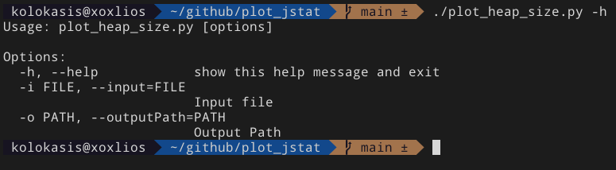

## Plot different graphs based on jstat

For more info on jstat please refer to - https://docs.oracle.com/javase/8/docs/technotes/tools/windows/jstat.html

## Track the size of the young and old generation

```bash
jstat -gccapacity <java process id> 1000 > heap_size.txt
```

## Plot young and old generation size

```bash
./plot_heap_size.py -i /path/to/heap_size.txt -o /path/to/generate/the/plots
```

## Help
```bash
./plot_heap_size.py -h
```

